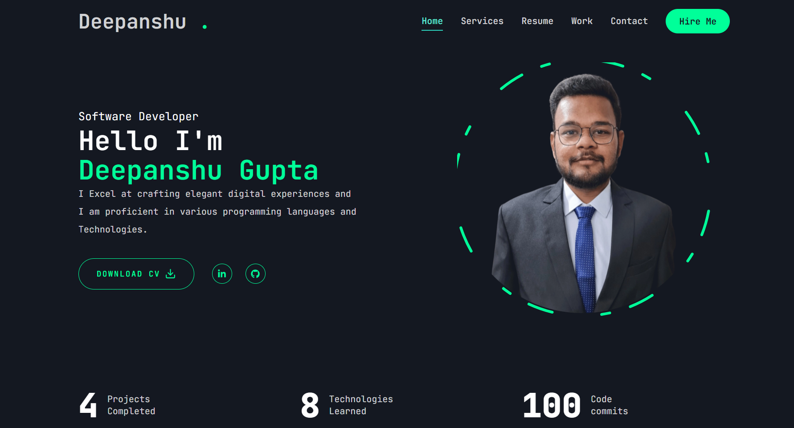

## Overview
This repository contains a portfolio website built with Next.js. It showcases a modern design, dynamic routing, SEO optimization, and is styled using Tailwind CSS. The application is easily deployable to platforms like Vercel or Netlify.

## ✨ Features

- **Modern Design**: A sleek, minimal, and professional user interface to make a lasting impression.
- **Dynamic Routing**: Smooth and fast navigation across different sections using SPA (Single Page Application) architecture.
- **SEO Optimization**: Carefully structured for improved visibility on search engines like Google and Bing.
- **Tailwind CSS Styling**: Built using [Tailwind CSS](https://tailwindcss.com/) for utility-first, customizable, and responsive design.
- **Deployment Ready**: Easily deployable on platforms like **Vercel**, **Netlify**

## Getting Started
To get started with the project, follow these steps:

1. **Clone the Repository:**
   ```bash
   git clone https://github.com/Deepanshu8560/Portfolio.git
2. **Navigate to the Project Directory:**
   ```bash
   cd Portfolio
3. **Install Dependencies:**
   ```bash
   npm install
4. **Run the Development Server:**
   ```bash
   npm run dev
5. Open in Browser: Navigate to http://localhost:3000 to view the application.

## 📁 Project Structure

- **`app/`** – Contains the main application files, pages, and route handlers.
- **`components/`** – Reusable UI components used throughout the portfolio.
- **`lib/`** – Utility functions, API helpers, and third-party integrations.
- **`public/`** – Static assets such as images, icons, and favicons.
- **`styles/`** – Global styles, Tailwind CSS setup, and custom themes.

---

## 📚 Learn More

To learn more about **Next.js** and how to extend this project, check out the following resources:

- 📘 [Next.js Documentation](https://nextjs.org/docs) – Comprehensive guide to Next.js features.
- 🧠 [Learn Next.js](https://nextjs.org/learn) – Interactive course to get started with Next.js fundamentals.

---

## 🚀 Deployment

The easiest way to deploy this portfolio is through **[Vercel](https://vercel.com/)** – the creators of Next.js. You can follow the official guide below to get started:

- 📦 [Next.js Deployment Documentation](https://nextjs.org/docs/deployment)

---

## 🔗 Live Demo

> _Add your deployed site link here (e.g. https://your-portfolio.vercel.app)_

---





## 🙌 Contributions

Feel free to fork the repository and submit pull requests or open issues to improve the project.


